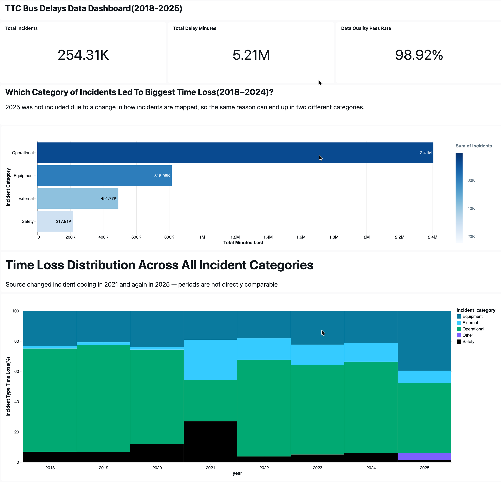

# TTC Bus Delays — Lakehouse Pipeline & Analysis

A medallion-architecture pipeline on Databricks over eight years of Toronto Transit Commission bus delay data, plus the analysis it was built to support.

**254,310 incidents · 2018–2025 · 98.92% validation pass rate**

---

## The finding

As a frequent user of TTC, it seems intuitive that TTC loses most of its time due to *breakdowns*

The intuitive answer to "where does TTC lose the most time" is *breakdowns* — they are the most frequent incident type. The data disagrees.

**Lost minutes sit in the tail, not in the frequency.** Equipment, External and Safety incidents all share a median of 10 minutes and a ceiling around 30 — when a vehicle fails, it gets swapped, and that takes a bounded amount of time. Operational failures have no such ceiling: a median of 12 minutes against a mean of 30.1, with individual incidents running up to 16 hours.

The consequence is that Operational produces **41.5% of incidents but 61.2% of lost minutes** (2018–2024).

Halving the number of breakdowns would halve a predictable, narrow distribution and leave the tail untouched. The time is in the rare, long operational failures — fewer events, more minutes, and no procedure bounding them.

📊 **[Full analysis, methodology and limitations →](docs/findings.md)**

---



---

## What the pipeline had to survive

The source data is not clean, and most of the engineering decisions here exist because of that.

**Schema drift across years.** Column names change between annual releases — `Report_Date`/`Date`, `Route`/`Line`, `Incident`/`Code`, `Direction`/`Bound`. Bronze keeps every variant as a separate column and lets silver merge them, so a new naming convention never breaks ingestion.

**Everything stays a string in bronze.** Type inference at the door loses data silently: a malformed value slips into `_rescued_data` and nobody notices. With strings, failure happens downstream in silver, where it is visible, counted, and quarantined with a reason.

**Three date formats and a non-standard time format.** Parsed through an explicit cascade rather than inference. The 2018–2020 files write times as `1:13:00 a.m.` — lowercase, with periods, no leading zero.

**The source changed its coding methodology twice**, in 2021 and again in 2025. The second change was found by querying the *shape* of the incident field rather than its meaning: text labels and short codes have **zero overlap** across years. This makes three stretches — 2018–2020, 2022–2024, 2025 — comparable only within themselves, which is why the dashboard reports them separately.

**Failed rows are quarantined, not dropped.** 3,118 rows sit in `silver.bus_delays_quarantine` tagged with the rule they broke, so data loss is auditable rather than invisible.

---

## Architecture

```
CSV files (8 annual releases)
        │  Auto Loader, schemaEvolutionMode = addNewColumns
        ▼
  bronze.bus_delays_raw          288,946 rows · 21 columns · all STRING
        │  unify column variants → parse dates/times → classify causes → validate
        ▼
  silver.bus_delays              284,262 rows      ← single source of truth
  silver.bus_delays_quarantine     3,118 rows      ← with failed_rule
  silver.incident_map                 96 codes     ← analyst-maintained, survives reruns
        │  CREATE OR REPLACE, filtered to complete years
        ▼
  gold.fct_bus_delays            254,310 rows · CLUSTER BY (event_date, route_id)
        ├── agg_route_performance
        ├── agg_incident_trends
        ├── agg_incident_by_hour
        └── agg_location_hotspots
```

Orchestrated as a four-task Databricks Job, serverless, with retries on the ingest task. Reruns are idempotent — verified by running the full pipeline twice and confirming the gold row count is unchanged.

### Layer reconciliation

| Layer | Rows |
|---|---|
| bronze | 288,946 |
| silver — passed | 284,262 |
| silver — quarantined | 3,118 |
| gold (2018–2025) | 254,310 |

Every gap is accounted for: 1,566 rows collapsed by deduplication on the business key, and 29,952 rows are an incomplete 2026 excluded from gold as a partial period. Both are verifiable by query, not asserted.

---

## Repository

```
notebooks/
  00_setup.sql          catalog, schemas, landing volume, monitoring table
  01_bronze_ingest.py   Auto Loader, schema evolution
  02_silver_build.py    parsing, classification, validation, quarantine
  03_gold_build.sql     fact table + four aggregates
  04_checks.sql         validation queries, pipeline logging
docs/
  findings.md           full analysis, assumptions, and limitations
```

---

## Stack

Databricks · Unity Catalog · PySpark · Spark Structured Streaming (Auto Loader) · Delta Lake · SQL · Databricks AI/BI

**Data source:** [City of Toronto Open Data — TTC Bus Delay Data](https://open.toronto.ca/dataset/ttc-bus-delay-data/)
